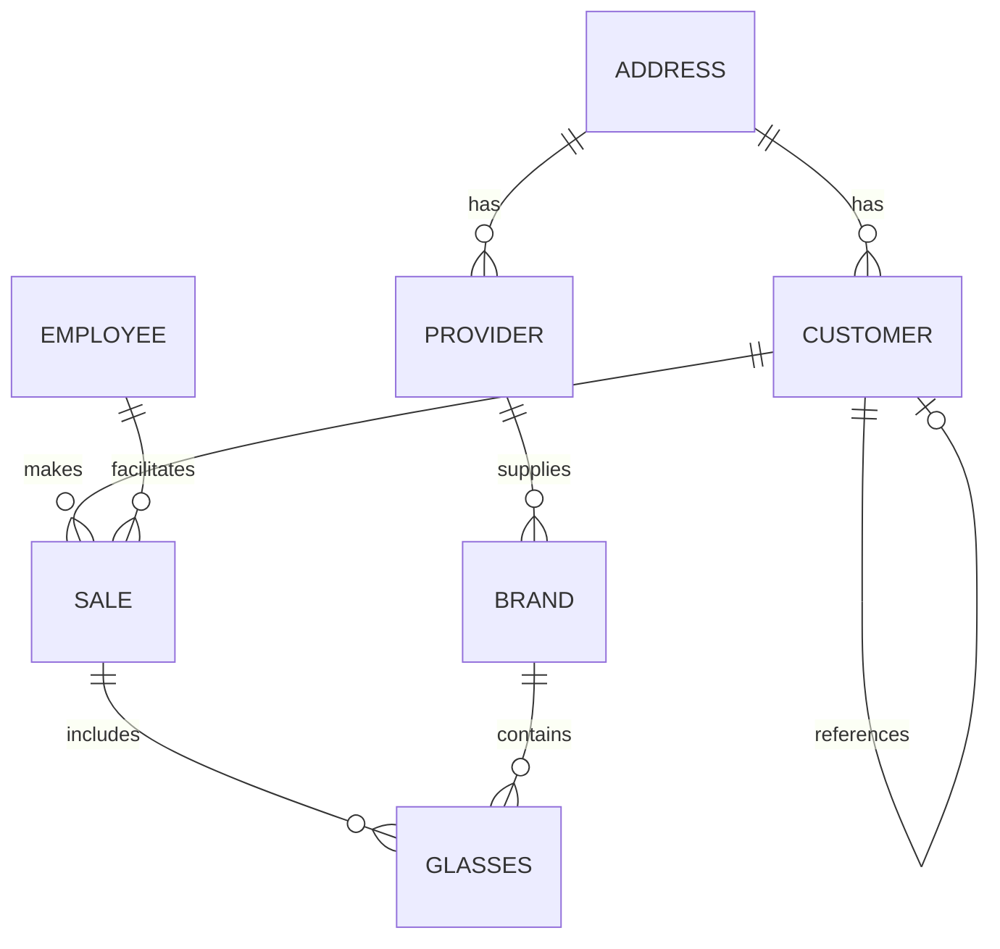

# 🕶️ Optics Database Schema: High-Level Relationships Overview

## 🌐 Schema: `optics`

### 📚 Tables and Relationships

---

### 📍 **Table: `address`**
- **Stores**: Address details.
- **Relationships**:
  - 🏡 **One-to-Many** with `customer`: One address can be associated with multiple customers.
  - 🏢 **One-to-Many** with `provider`: One address can be associated with multiple providers.

---

### 👥 **Table: `customer`**
- **Stores**: Customer information.
- **Relationships**:
  - 🏡 **Many-to-One** with `address`: Multiple customers can be related to the same address.
  - 🛍️ **One-to-Many** with `sale`: One customer can have multiple sales.
  - 🔁 **Self-referencing**: Customers can have hierarchical relationships (e.g., parent-child).

---

### 👨‍💼 **Table: `employee`**
- **Stores**: Employee information.
- **Relationships**:
  - 🛍️ **One-to-Many** with `sale`: One employee can be associated with multiple sales.

---

### 🛒 **Table: `sale`**
- **Stores**: Sale information.
- **Relationships**:
  - 👥 **Many-to-One** with `customer`: Each sale involves one customer.
  - 👨‍💼 **Many-to-One** with `employee`: Each sale involves one employee.
  - 🕶️ **One-to-Many** with `glasses`: One sale can include multiple glasses.

---

### 🏢 **Table: `provider`**
- **Stores**: Provider information.
- **Relationships**:
  - 🏡 **Many-to-One** with `address`: Each provider has a unique address.
  - 🏷️ **One-to-Many** with `brand`: Each provider can supply multiple brands.

---

### 🏷️ **Table: `brand`**
- **Stores**: Brand information.
- **Relationships**:
  - 🏢 **Many-to-One** with `provider`: Each brand is provided by a single provider.

---

### 🕶️ **Table: `glasses`**
- **Stores**: Glasses details.
- **Relationships**:
  - 🏷️ **Many-to-One** with `brand`: Each pair of glasses is associated with one brand.
  - 🛍️ **Many-to-One** with `sale`: Each pair of glasses can be part of a single sale.

---

### 🗺️ Relationship Diagram

