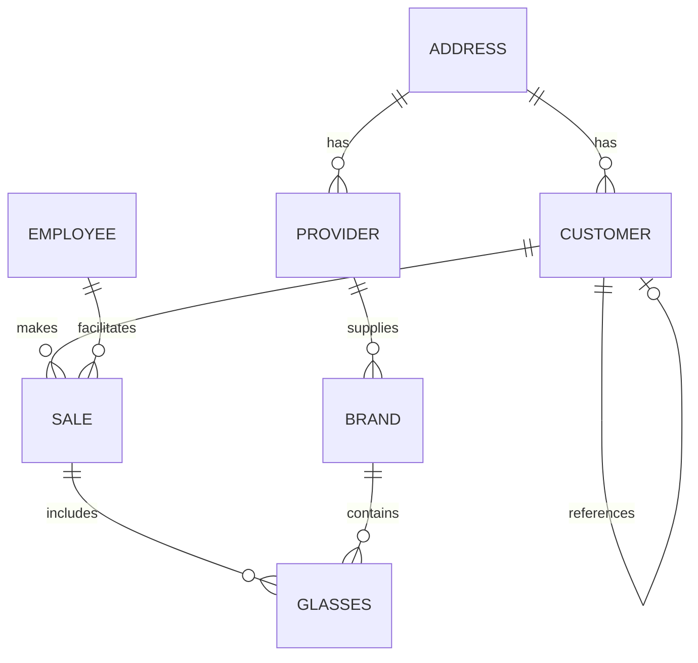
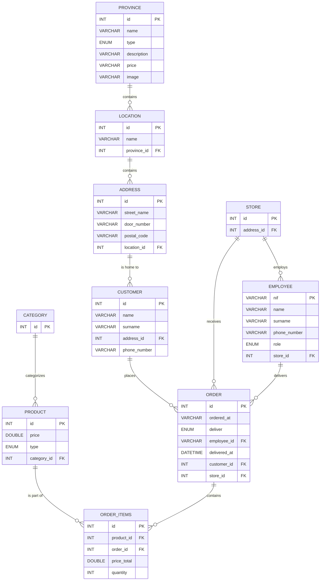

# 🕶️ Optics Database Schema: High-Level Relationships Overview

## 🌐 Schema: `optics`

### 📚 Tables and Relationships

---

### 📍 **Table: `address`**
- **Stores**: Address details.
- **Relationships**:
  - 🏡 **One-to-Many** with `customer`: One address can be associated with multiple customers.
  - 🏢 **One-to-Many** with `provider`: One address can be associated with multiple providers.

---

### 👥 **Table: `customer`**
- **Stores**: Customer information.
- **Relationships**:
  - 🏡 **Many-to-One** with `address`: Multiple customers can be related to the same address.
  - 🛍️ **One-to-Many** with `sale`: One customer can have multiple sales.
  - 🔁 **Self-referencing**: Customers can have hierarchical relationships (e.g., parent-child).

---

### 👨‍💼 **Table: `employee`**
- **Stores**: Employee information.
- **Relationships**:
  - 🛍️ **One-to-Many** with `sale`: One employee can be associated with multiple sales.

---

### 🛒 **Table: `sale`**
- **Stores**: Sale information.
- **Relationships**:
  - 👥 **Many-to-One** with `customer`: Each sale involves one customer.
  - 👨‍💼 **Many-to-One** with `employee`: Each sale involves one employee.
  - 🕶️ **One-to-Many** with `glasses`: One sale can include multiple glasses.

---

### 🏢 **Table: `provider`**
- **Stores**: Provider information.
- **Relationships**:
  - 🏡 **Many-to-One** with `address`: Each provider has a unique address.
  - 🏷️ **One-to-Many** with `brand`: Each provider can supply multiple brands.

---

### 🏷️ **Table: `brand`**
- **Stores**: Brand information.
- **Relationships**:
  - 🏢 **Many-to-One** with `provider`: Each brand is provided by a single provider.

---

### 🕶️ **Table: `glasses`**
- **Stores**: Glasses details.
- **Relationships**:
  - 🏷️ **Many-to-One** with `brand`: Each pair of glasses is associated with one brand.
  - 🛍️ **Many-to-One** with `sale`: Each pair of glasses can be part of a single sale.

---

### 🗺️ Relationship Diagram



# Pizza shop

## Database Schema

### Entities and Relationships



## Entity Descriptions

### Province
Stores information about food and beverage items.
- **id**: Unique identifier for each item.
- **name**: Name of the item.
- **type**: Type of item (drink, pizza, hamburger).
- **description**: Description of the item.
- **price**: Price of the item.
- **image**: Image URL of the item.

### Location
Stores information about locations.
- **id**: Unique identifier for each location.
- **name**: Name of the location.
- **province_id**: Foreign key referencing `province`.

### Address
Stores detailed address information.
- **id**: Unique identifier for each address.
- **street_name**: Name of the street.
- **door_number**: Door number.
- **postal_code**: Postal code.
- **location_id**: Foreign key referencing `location`.

### Customer
Stores information about customers.
- **id**: Unique identifier for each customer.
- **name**: First name of the customer.
- **surname**: Surname of the customer.
- **address_id**: Foreign key referencing `address`.
- **phone_number**: Contact number.

### Store
Stores information about stores.
- **id**: Unique identifier for each store.
- **address_id**: Foreign key referencing `address`.

### Employee
Stores information about employees.
- **nif**: Unique identifier (e.g., national identification number).
- **name**: First name of the employee.
- **surname**: Surname of the employee.
- **phone_number**: Contact number.
- **role**: Role of the employee (cooker, deliverer).
- **store_id**: Foreign key referencing `store`.

### Order
Stores information about orders.
- **id**: Unique identifier for each order.
- **ordered_at**: Timestamp of when the order was placed.
- **deliver**: Delivery method (takeaway, home).
- **employee_id**: Foreign key referencing `employee`.
- **delivered_at**: Timestamp of when the order was delivered.
- **customer_id**: Foreign key referencing `customer`.
- **store_id**: Foreign key referencing `store`.

### Category
Stores information about product categories.
- **id**: Unique identifier for each category.

### Product
Stores information about products.
- **id**: Unique identifier for each product.
- **price**: Price of the product.
- **type**: Type of product (drink, hamburger, pizza).
- **category_id**: Foreign key referencing `category`.

### Order Items
Stores information about order items.
- **id**: Unique identifier for each order item.
- **product_id**: Foreign key referencing `product`.
- **order_id**: Foreign key referencing `order`.
- **price_total**: Total price for the order item.
- **quantity**: Quantity of the product in the order.

## Triggers

### `order_if_home_delivery_employee_and_date_not_null`
This trigger ensures that for home delivery orders, both `employee_id` and `ordered_at` must be provided.

```sql
DELIMITER $$

CREATE TRIGGER `order_if_home_delivery_employee_and_date_not_null`
BEFORE INSERT ON `order`
FOR EACH ROW
BEGIN
    DECLARE hasHomeDelivery BOOLEAN;

    SET hasHomeDelivery = (NEW.deliver = 'home');

    IF hasHomeDelivery THEN
        IF NEW.employee_id IS NULL THEN
            IF NEW.ordered_at IS NULL THEN
                SIGNAL SQLSTATE '45000'
                    SET MESSAGE_TEXT = 'For home deliveries, both employee_id and ordered_at must be provided.';
            END IF;
        ELSE
            IF NEW.ordered_at IS NULL THEN
                SIGNAL SQLSTATE '45000'
                    SET MESSAGE_TEXT = 'For home deliveries, ordered_at must be provided.';
            END IF;
        END IF;
    END IF;

    IF NEW.employee_id IS NULL THEN
        IF NEW.order_id IS NULL THEN
            SIGNAL SQLSTATE '45000'
                SET MESSAGE_TEXT = 'If employee_id is not specified, then order_id must be provided.';
        END IF;
    END IF;
END$$

DELIMITER ;
```

### `product_if_type_is_pizza_then_category_id_must_be_not_null`
This trigger ensures that for products of type "pizza", `category_id` cannot be null.

```sql
DELIMITER $$

CREATE TRIGGER `product_if_type_is_pizza_then_category_id_must_be_not_null`
BEFORE UPDATE ON `product`
FOR EACH ROW
BEGIN
    IF NEW.type = 'pizza' AND NEW.category_id IS NULL THEN
        SIGNAL SQLSTATE '45000'
            SET MESSAGE_TEXT = 'For products of type "pizza", category_id cannot be null.';
    END IF;
END$$

DELIMITER ;
```

## Visual Representation of Relationships

Here's a high-level view of the relationships between entities in the schema:

- A **Province** contains multiple **Locations**.
- A **Location** contains multiple **Addresses**.
- An **Address** is home to multiple **Customers**.
- A **Customer** places multiple **Orders**.
- A **Store** employs multiple **Employees**.
- A **Store** receives multiple **Orders**.
- An **Employee** delivers multiple **Orders**.
- A **Category** categorizes multiple **Products**.
- A **Product** is part of multiple **Order Items**.
- An **Order** contains multiple **Order Items**.
